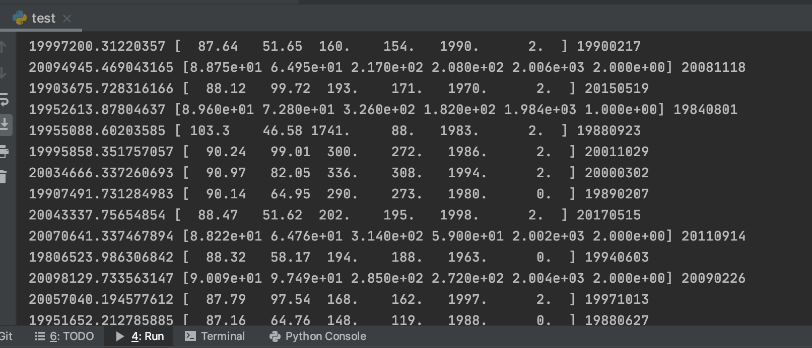

## Our Models

### First iteration

We started by training a simple model with the SATCAT data avaialble to us from Space-Track.org

How2, our first model, took an input of 6 attributes and tried to predict the decay date of an object based on those values, running them through a linear regression algorithm.

This basic algorithm resulted in a prediction that had 43% accuracy.

Which was not the best. 

Here is one of poor How2's first attempt at guessing the date (his prediction is on the left and the real decay date is on the right)

>Attributes from left to right include, predicted date, period, inclination, apogee, perigee, RCS Size, launch year and the real decay date
